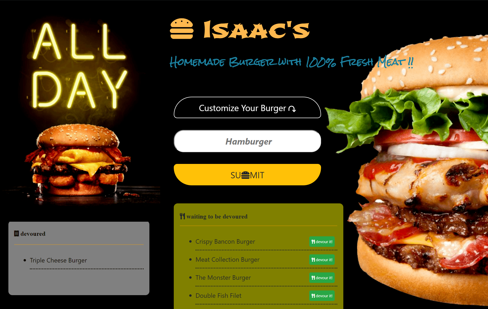

# 🍔Eat-Da-Burger

####   :point_right: Click  **[>>>Here<<<](https://eatdaburger-iw.herokuapp.com/)**  Check my Friend Finder APP.

* Eat-Da-Burger! is a restaurant app that lets users input the names of burgers they'd like to eat.

* Whenever a user submits a burger's name, Eat-Da-Burger! will display the burger in the 'waiting to be devoured' list.

* Each burger in the waiting area also has a `Devour it!` button. When the user clicks it, the burger will move to the left side of the page.

Eat-Da-Burger! built with Node.js and Express.js

## Author
* [Isaac Wu](https://github.com/squall2046)
* [GitHub Repo](https://github.com/squall2046/Eat-Da-Burger)

## Copyright
Isaac Wu © 2019 All Rights Reserved
